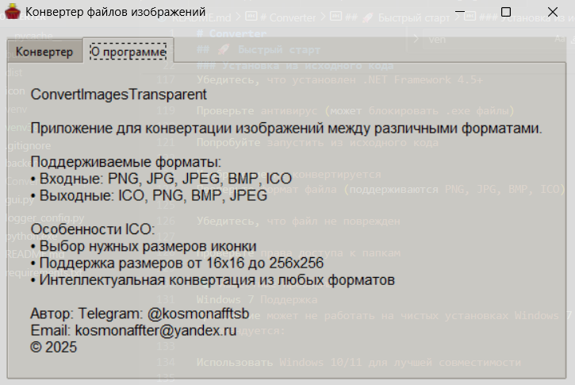

# Converter

icon/Снимок _1.png

Приложение для конвертации изображений между различными форматами с поддержкой создания ICO файлов с выбором размеров.

## ✨ Возможности

- **Конвертация форматов** - преобразование между PNG, JPG, BMP, ICO
- **Создание ICO иконок** - поддержка размеров от 16x16 до 256x256
- **Выбор размеров** - пользователь сам выбирает нужные размеры иконки
- **Простой интерфейс** - интуитивно понятное графическое окно
- **Подробное логирование** - запись всех действий и ошибок

## 🚀 Быстрый старт

### Скачать готовую версию
1. Скачайте файл `Converter.exe` из папки `dist/`
2. Запустите исполняемый файл
3. Выберите изображение, формат и нажмите "Конвертировать"

### Установка из исходного кода
1. Клонируйте репозиторий:
```bash
git clone https://github.com/Kosmonaffter/Converter.git
cd Converter
Установите зависимости:

bash
pip install -r requirements.txt
Запустите приложение:

bash
python gui.py
🛠️ Сборка исполняемого файла
Автоматическая сборка:
bash
python build.py
Ручная сборка PyInstaller:
bash
pyinstaller --onefile --windowed --icon=icon/Icon_apps.ico --name Converter gui.py
📁 Структура проекта
text
Converter/
├── icon/                # Иконки приложения
│   └── Icon_apps.ico
├── gui.py              # Основной файл GUI приложения
├── backend.py          # Логика обработки изображений
├── logger_config.py    # Конфигурация логирования
├── requirements.txt   # Зависимости проекта
└── README.md         # Документация
🎯 Как использовать
Основная конвертация:
Запустите приложение - откройте Converter.exe

Выберите изображение - нажмите "Обзор..." и выберите файл

Выберите формат - выберите желаемый формат из выпадающего списка

Укажите путь сохранения - выберите куда сохранить результат

Обработайте - нажмите "Конвертировать"

Для создания ICO файлов:
Выберите формат "ICO"

Появится панель выбора размеров

Отметьте нужные размеры иконки ( 16x16, 32x32, 48x48, 64x64, 128x128, 256x256 )

Используйте кнопки "Выбрать все" или "Сбросить" для быстрого выбора

Нажмите "Конвертировать"

🔧 Технические детали
Поддерживаемые форматы:
Входные: PNG, JPG, JPEG, BMP, ICO

Выходные: ICO, PNG, BMP, JPEG

Особенности ICO:
Пользовательский выбор размеров иконок

Автоматическая конвертация из любых форматов

Поддержка стандартных размеров Windows

Зависимости:
Pillow - работа с изображениями

tkinter - графический интерфейс ( входит в стандартную поставку Python )

pyinstaller - сборка исполняемых файлов

⚠️ Проблемы и решения
Приложение не запускается на Windows 7
Проблема: Приложение собрано с использованием современных библиотек, которые могут требовать обновленные системные компоненты.

Возможные решения:

Установите последний Service Pack для Windows 7

Обновите .NET Framework до версии 4.5 или выше

Установите Visual C++ Redistributable:

VC++ 2015: https://www.microsoft.com/ru-ru/download/details.aspx?id=52685

VC++ 2019: https://aka.ms/vs/16/release/vc_redist.x86.exe

Попробуйте собрать приложение на Windows 7:

bash
pip install pyinstaller pillow
pyinstaller --onefile --windowed gui.py
Приложение не запускается на современных Windows
Убедитесь, что установлен .NET Framework 4.5+

Проверьте антивирус (может блокировать .exe файлы)

Попробуйте запустить из исходного кода

Изображение не конвертируется
Проверьте формат файла (поддерживаются PNG, JPG, BMP, ICO)

Убедитесь, что файл не поврежден

Проверьте права доступа к папкам

🐛 Известные проблемы
Windows 7 Поддержка
Приложение может не работать на чистых установках Windows 7 без обновлений. Рекомендуется:

Использовать Windows 10/11 для лучшей совместимости

Или собрать приложение непосредственно на Windows 7

Большие изображения
Очень большие изображения (более 10MB) могут обрабатываться медленно.

📞 Поддержка
Автор: Юрий Атласюк
Telegram: @kosmonafftsb
Email: kosmonaffter@yandex.ru
Год: 2025
